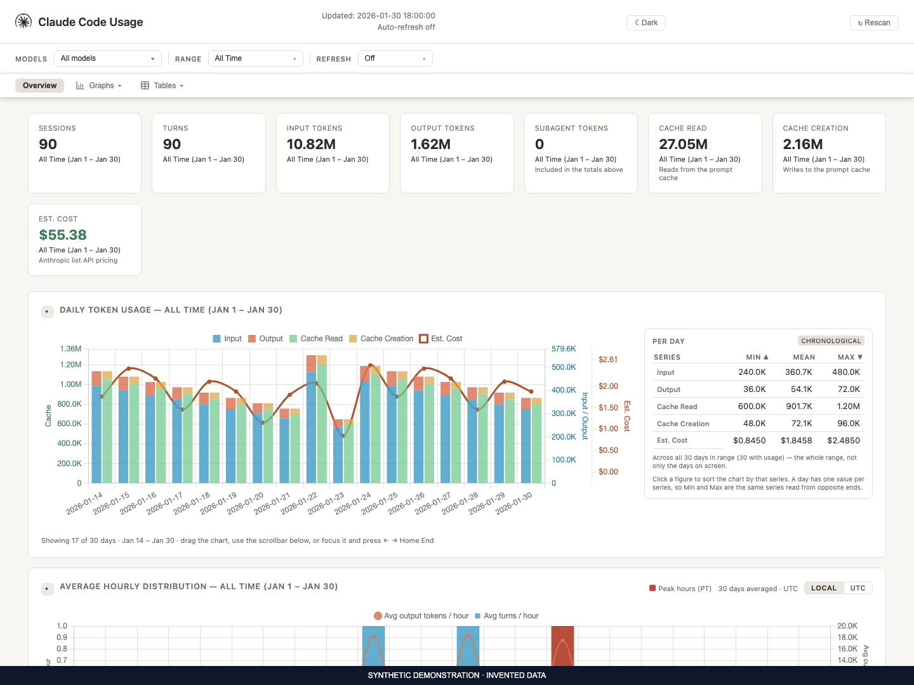
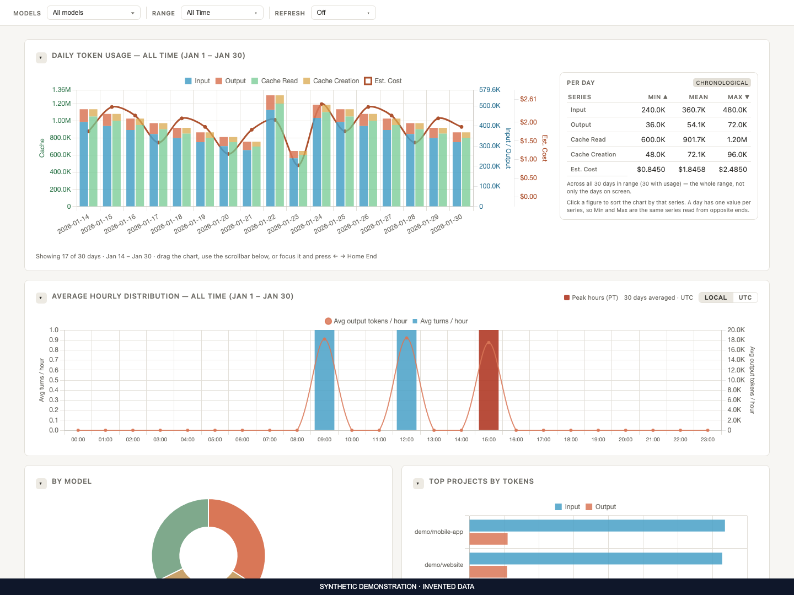
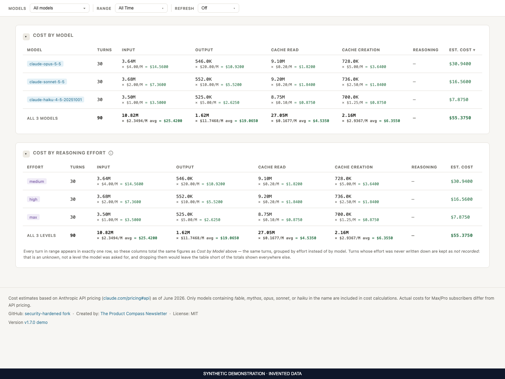

# Claude Code and Codex Usage Dashboard

A local dashboard and command-line tool for **Claude Code and Codex** usage.
Explore tokens, API-equivalent cost estimates, models, projects, sessions,
subagents, and quota windows. Use it in your browser or inside VS Code.

- **Both assistants:** local Claude Code JSONL transcripts and Codex rollouts.
- **Docker collection:** discover logs from running and stopped local containers.
- **Docker deployment:** run an isolated dashboard with read-only transcript mounts.
- **Local storage:** SQLite on your machine; no telemetry or automatic internet requests.
- **Open source:** MIT licensed, including commercial use, modification and redistribution.

Optional live Anthropic quota queries require explicit opt-in and credentials.
See [Privacy](PRIVACY.md) for the data stored locally and the network boundary.



*The screenshots use invented projects and usage figures. They are examples,
not a record of anyone's account or spending.*

The fixtures and capture process are preserved in `scripts/render-demo.py`.
It inserts 90 invented sessions into a temporary database, blocks real usage
paths, and renders the page with a fresh browser profile in UTC. To regenerate:

```bash
python3 scripts/render-demo.py --browser /path/to/chrome-headless-shell
```

## Quick Start

Requires **Python 3.11+**. The Python runtime uses only the standard library;
Chart.js is bundled locally. No API key is needed to read usage logs.

```bash
git clone https://github.com/mlizaso/claude-usage.git
cd claude-usage
python3 cli.py dashboard
```

On Windows, use `python` instead of `python3`. Open the authenticated localhost
URL printed by the command. Keep that URL private: its fragment contains the
dashboard access token.

### Install with uv, pipx or pip

```bash
uv tool install git+https://github.com/mlizaso/claude-usage.git
claude-usage dashboard
```

`pipx install` accepts the same Git URL. For `pip`, install inside a virtual
environment. These commands install this repository directly.

### Homebrew (macOS / Linux)

```bash
brew tap mlizaso/claude-usage https://github.com/mlizaso/claude-usage.git
brew install --HEAD mlizaso/claude-usage/claude-usage
claude-usage dashboard
```

The formula builds the current `main` branch. Review changes before upgrading.

### VS Code

Download this project's `.vsix` from [GitHub Releases](https://github.com/mlizaso/claude-usage/releases),
or build it from source. Python 3.11+ is required on the machine running VS Code.
See the [extension guide](VS-CODE-EXTENSION.md).

## What this tracks

| Source | Default location | Notes |
|---|---|---|
| Claude Code | `~/.claude/projects/**/*.jsonl` | CLI and compatible editor integrations; usage from API and subscription sessions |
| Codex | `~/.codex/sessions/**/*.jsonl` | Local rollout usage and quota events |
| Xcode Claude integration | `~/Library/Developer/Xcode/CodingAssistant/ClaudeAgentConfig/projects/` | Scanned when present on macOS |
| Local Docker containers | Discovered transcript roots | Collected by the host CLI and VS Code extension |

Missing default directories are skipped. Additional directories can be passed
with `--projects-dir`; the CLI still includes its default roots. Only usage
that exists in supported transcript files can be reconstructed. Remote or
cloud sessions without a local transcript are outside this tool's coverage.

## Codex

Claude Code and Codex share the scan core and database, with source-qualified
identities to keep equal session or message IDs separate. When both sources
contain data, the dashboard asks which to display. Switch with **Source** or
open a link with `?source=codex` or `?source=claude`.

Codex cached and cache-write tokens are subsets of total input. The scanner
subtracts them to obtain ordinary input. Reasoning tokens are a **subset of
output tokens**: displayed separately, never added to output or priced twice.
Reasoning effort is shown when a transcript records it.

Synthetic example: 2,000 of 5,000 output tokens are reasoning tokens — 40%.
The total output is still 5,000 tokens, and that is the amount priced.

Parent responses replayed in subagent rollouts are deduplicated by lineage.
The producer's attribution takes precedence over the order files were found.
Missing or pruned transcripts can leave gaps; this tool does not recover
deleted provider history.

The displayed cost is an API-equivalent estimate. A subscription quota or
monthly charge is a different measure. Built-in estimated model rates are
marked with a dagger in the tables below.

## Docker

Docker support has two independent modes:

| Mode | Claude Code | Codex | How to start |
|---|---|---|---|
| Collect usage from local containers into the host dashboard | Yes | Yes | Run the host CLI or VS Code extension normally |
| Run the dashboard itself in Docker | Yes | Requires an additional read-only mount | `bash scripts/run-docker.sh` |

### Automatic Docker usage collection

Host scans discover running and stopped containers without changing their
Dockerfiles or Compose configuration. Discovery checks configured homes,
`CLAUDE_CONFIG_DIR`, `CODEX_HOME`, and relevant mounts. Host bind mounts already
being scanned are reused; other logs are imported through Docker's archive API.
No command is executed inside a container.

Imported JSONL files are stored in `<database>.docker-transcripts/`. **This
cache contains full transcripts**, which may include prompts, responses and
secrets. It persists even after a container disappears. Keep it private and
delete it separately when you want to remove imported history.

Collection accepts only a local Unix socket or Windows named pipe from the
saved default Docker context. It requires Docker Engine **29.5.1+** and a Docker
CLI in a supported system or Docker Desktop location. Remote SSH/TCP contexts
are refused. Collection has bounded time, size and concurrency limits; the
dashboard reports a partial refresh if a container or limit prevents completion.

Disable discovery before launching the host application with:

```bash
CLAUDE_USAGE_DOCKER=0 python3 cli.py dashboard
```

In PowerShell, set `$env:CLAUDE_USAGE_DOCKER = "0"` before launching.
Python API callers opt in with `scan(..., include_docker=True)`.

### Run the dashboard in Docker

From the checkout, with Bash and Docker Engine **28+**:

```bash
bash scripts/run-docker.sh
```

The launcher builds this checkout and prints an authenticated URL on
`http://localhost:9898`. Change the port with `CLAUDE_USAGE_DOCKER_PORT`.
It mounts only Claude's `projects` directory read-only and uses
`~/.local/share/claude-usage-docker` for its database. A mount-free proxy
publishes the isolated application on host loopback. It drops capabilities,
uses read-only container filesystems, and keeps the transcript reader on an
internal network without an outbound route.

**The supplied launcher mounts Claude Code logs only.** Codex parsing is
included in the image, but using it in this deployment requires a reviewed
launcher change to add `~/.codex/sessions` as a read-only mount at
`/home/claudeusage/.codex/sessions`. It is not an existing launcher option.
Use the host application for automatic collection of both assistants.
The isolated container has no host Docker socket and cannot discover other
containers. Do not mount credentials or your entire home directory.

## Usage

```bash
python3 cli.py scan
python3 cli.py today
python3 cli.py week --source codex
python3 cli.py stats --source all
python3 cli.py dashboard --host 127.0.0.1 --port 9000
python3 cli.py url --open
python3 cli.py scan --projects-dir /path/to/additional/transcripts
```

Installed users can replace `python3 cli.py` with `claude-usage`.
Reports accept `--source claude`, `codex`, or `all`. Run a command with
`--help` for its options. The default database is `~/.claude/usage.db`.

| Environment variable | Purpose |
|---|---|
| `CLAUDE_USAGE_DB` | Choose a different private database path |
| `CLAUDE_USAGE_PROJECTS_DIRS` | Add roots separated by `:` on POSIX or `;` on Windows |
| `CLAUDE_USAGE_DOCKER=0` | Disable local container discovery |
| `CLAUDE_USAGE_RATES` | Path to a local JSON rate-override file |
| `HOST`, `PORT` | Dashboard loopback address and port |
| `CLAUDE_USAGE_THRESHOLDS` | Path to saved quota-alert thresholds |

Launchers use explicit environment allowlists. In particular the Docker
launcher and VS Code extension do not forward `CLAUDE_USAGE_PROJECTS_DIRS`.

## How it works

1. Discover regular JSONL files in the selected roots.
2. Parse Claude Code and Codex records, reconcile streaming updates and replayed turns.
3. Save usage metadata in SQLite and recompute session totals from turns.
4. Query source-filtered rollups for terminal reports and the authenticated dashboard.

Scanning is incremental. A saved cursor is reused only when file identity,
metadata and the previously read prefix still match. A changed prefix is read
again. The source transcripts are never modified.

The database is derived data. When its schema changes, the application rebuilds
it and rescans available transcripts. History whose transcripts no longer
exist cannot be reconstructed. Stop the application or use SQLite's backup API
to make a consistent database backup; copying an active WAL database alone is
not a complete backup.

### Dashboard features

- Daily and hourly charts, local date ranges, model and project filters.
- Costs by model, project, branch and reasoning effort.
- Session titles, subagent attribution and CSV exports.
- Light/dark themes and collapsible cards.
- Saved startup results displayed while a background refresh runs.
- Quota windows and configurable threshold notifications.

Quota data can be stale. The page shows reading age and expired windows.
**Quota alerts.** Crossing a configured threshold always shows an in-page banner.
Desktop notifications are also delivered when the browser grants permission.
Thresholds are saved locally for each quota window.

An independent quota page is available with `python3 limits_server.py`;
it does not open the usage database. See [Limits backend](LIMITS-BACKEND.md).




### Security and privacy

The server binds to loopback, authenticates data routes, checks Host and Origin,
and serves bundled scripts under a restrictive Content Security Policy.
It sends no telemetry. Optional live Anthropic quota requests require both
`CLAUDE_USAGE_LIVE_LIMITS=1` and an explicit credential source.

**Local does not mean anonymous.** The database, snapshots, CSV exports and
screenshots can contain project names, branches, session titles, identifiers
and usage patterns. Container imports contain full transcripts. Never attach
these files to a public issue. Use an invented reproduction instead.
Read [Privacy](PRIVACY.md) and [Security](SECURITY.md) before sharing diagnostics.

## Cost estimates

The bundled rate tables below describe this version's estimates. They are not
live vendor prices or an invoice. Pricing resolution uses an **exact** model
ID, then the longest ID the model **starts with**, then a family **keyword**
such as `opus`, `sonnet`, `haiku`, `gpt-5` or `codex`.

An unknown model has no rate: the dashboard displays `n/a` rather than `$0.00`
and CSV cost cells are empty. Terminal reports currently print `cost=$0.0000`
for that case; it means no known rate. A local model whose name contains a
known keyword can inherit that family's estimate. Use `CLAUDE_USAGE_RATES`
to set your own rates, in USD per million tokens:

```json
{"example-model": {"input": 1.0, "output": 2.0, "cache_read": 0.1}}
```

### Anthropic rates

Opus 5.5, Sonnet 5.5, Fable 5.1 and Mythos 5.1 have explicit standard API
rates, verified on **2026-09-29**. Older model IDs keep their existing rates.
Opus 5.5 cache reads cost 5% of input; Fable/Mythos 5.1 cache reads cost 2.5%.

Bundled Anthropic estimates. Check the [provider's pricing documentation](https://platform.claude.com/docs/en/about-claude/pricing)
when updating them. Cache-write TTLs have separate rates.

<!-- BEGIN GENERATED PRICING TABLE: anthropic. Run scripts/generate-pricing-assets.py. -->
| Model | Input | Output | Cache Write (5m) | Cache Write (1h) | Cache Read |
|-------|-------|--------|------------------|------------------|------------|
| claude-fable-5-1 | $10.00/MTok | $50.00/MTok | $12.50/MTok | $20.00/MTok | $0.25/MTok |
| claude-mythos-5-1 | $10.00/MTok | $50.00/MTok | $12.50/MTok | $20.00/MTok | $0.25/MTok |
| claude-fable-5 | $10.00/MTok | $50.00/MTok | $12.50/MTok | $20.00/MTok | $1.00/MTok |
| claude-mythos-5 | $10.00/MTok | $50.00/MTok | $12.50/MTok | $20.00/MTok | $1.00/MTok |
| claude-opus-5-5 | $4.00/MTok | $20.00/MTok | $5.00/MTok | $8.00/MTok | $0.20/MTok |
| claude-opus-5 | $5.00/MTok | $25.00/MTok | $6.25/MTok | $10.00/MTok | $0.50/MTok |
| claude-opus-4-8 | $5.00/MTok | $25.00/MTok | $6.25/MTok | $10.00/MTok | $0.50/MTok |
| claude-opus-4-7 | $5.00/MTok | $25.00/MTok | $6.25/MTok | $10.00/MTok | $0.50/MTok |
| claude-opus-4-6 | $5.00/MTok | $25.00/MTok | $6.25/MTok | $10.00/MTok | $0.50/MTok |
| claude-opus-4-5 | $5.00/MTok | $25.00/MTok | $6.25/MTok | $10.00/MTok | $0.50/MTok |
| claude-sonnet-5-5 | $2.00/MTok | $10.00/MTok | $2.50/MTok | $4.00/MTok | $0.20/MTok |
| claude-sonnet-5 | $2.00/MTok | $10.00/MTok | $2.50/MTok | $4.00/MTok | $0.20/MTok |
| claude-sonnet-4-7 | $3.00/MTok | $15.00/MTok | $3.75/MTok | $6.00/MTok | $0.30/MTok |
| claude-sonnet-4-6 | $3.00/MTok | $15.00/MTok | $3.75/MTok | $6.00/MTok | $0.30/MTok |
| claude-sonnet-4-5 | $3.00/MTok | $15.00/MTok | $3.75/MTok | $6.00/MTok | $0.30/MTok |
| claude-haiku-4-7 | $1.00/MTok | $5.00/MTok | $1.25/MTok | $2.00/MTok | $0.10/MTok |
| claude-haiku-4-6 | $1.00/MTok | $5.00/MTok | $1.25/MTok | $2.00/MTok | $0.10/MTok |
| claude-haiku-4-5 | $1.00/MTok | $5.00/MTok | $1.25/MTok | $2.00/MTok | $0.10/MTok |
<!-- END GENERATED PRICING TABLE: anthropic. -->

### OpenAI / Codex rates

GPT-6 Astra, Sol and Luna have explicit standard API rates, verified on
**2026-09-29**. Requests above 272,000 input-side tokens use twice the input
and cache rates and 1.5 times the output rate. Older GPT-5.6 rates and dated
policies remain separate.

Bundled OpenAI estimates. Check the [provider's pricing documentation](https://developers.openai.com/api/docs/pricing)
when updating them. Subscription charges are not calculated from these tables.
These are standard API-equivalent estimates; Fast, Batch, Flex, regional
premiums and subscription credits are not inferred from the transcripts.

<!-- BEGIN GENERATED PRICING TABLE: openai. Run scripts/generate-pricing-assets.py. -->
| Model | Input | Output | Cache Write (5m) | Cache Write (1h) | Cache Read |
|-------|-------|--------|------------------|------------------|------------|
| gpt-6-astra | $10.00/MTok | $50.00/MTok | $12.50/MTok | $12.50/MTok | $1.00/MTok |
| gpt-6-sol | $2.00/MTok | $10.00/MTok | $2.50/MTok | $2.50/MTok | $0.20/MTok |
| gpt-6-luna | $0.10/MTok | $0.50/MTok | $0.125/MTok | $0.125/MTok | $0.01/MTok |
| gpt-5.6-sol | $4.00/MTok | $20.00/MTok | $5.00/MTok | $5.00/MTok | $0.40/MTok |
| gpt-5.6-terra | $2.00/MTok | $12.00/MTok | $2.50/MTok | $2.50/MTok | $0.20/MTok |
| gpt-5.6-luna | $0.20/MTok | $1.20/MTok | $0.25/MTok | $0.25/MTok | $0.02/MTok |
| gpt-5.5 | $5.00/MTok | $30.00/MTok | $5.00/MTok | $5.00/MTok | $0.50/MTok |
| gpt-5.4 | $2.50/MTok | $15.00/MTok | $2.50/MTok | $2.50/MTok | $0.25/MTok |
| gpt-5.4-mini | $0.75/MTok | $4.50/MTok | $0.75/MTok | $0.75/MTok | $0.075/MTok |
| gpt-5.4-nano | $0.20/MTok | $1.25/MTok | $0.20/MTok | $0.20/MTok | $0.02/MTok |
| gpt-5.3-codex | $1.75/MTok | $14.00/MTok | $1.75/MTok | $1.75/MTok | $0.175/MTok |
| gpt-5.3-codex-spark † | $1.75/MTok | $14.00/MTok | $1.75/MTok | $1.75/MTok | $0.175/MTok |
| codex-auto-review † | $1.75/MTok | $14.00/MTok | $1.75/MTok | $1.75/MTok | $0.175/MTok |
<!-- END GENERATED PRICING TABLE: openai. -->

† Estimated fallback rates for IDs without a verified built-in price.
The dashboard marks usage priced with these estimates.

Date-dependent policies and long-context tiers are applied per request before
aggregation. Two short requests do not become one long request by being grouped.
Local overrides take precedence over built-in rates.

### New models and pricing updates

New IDs are discovered from transcripts automatically. Adding a price needs
a separate verified source. Edit `claude_usage/pricing.py`, then run:

```bash
python3 scripts/generate-pricing-assets.py
python3 scripts/generate-pricing-assets.py --check
```

This keeps Python, browser pricing and these generated tables in agreement.

## Origin, contributions and license

This project is based on **[phuryn/claude-usage](https://github.com/phuryn/claude-usage)**,
created by **[Paweł Huryn (`phuryn`)](https://github.com/phuryn)**. His repository
provided the original codebase. This version builds on that work with Codex
support, local Docker collection, and additional privacy and reliability controls.

Contributions are welcome. See [Contributing](CONTRIBUTING.md) for setup,
validation and safe bug reports, and [Security](SECURITY.md) for vulnerabilities.

The project uses the [MIT license](https://github.com/mlizaso/claude-usage/blob/main/LICENSE).
You may use, modify and redistribute it, including commercially, while keeping
the copyright and license notice. The software is provided without warranty.
The original author's copyright and upstream contributor credits are retained.
See [Third-party notices](THIRD-PARTY-NOTICES.md) for bundled dependencies.
This is an independent project, unaffiliated with Anthropic or OpenAI.

## Files

| File | Purpose |
|---|---|
| `claude_usage/` | Parsers, database, reports, HTTP services and safety helpers |
| `cli.py` | Checkout launcher |
| `web/` | Dashboard and standalone quota-page assets |
| `vendor/` | Bundled Chart.js and its license |
| `vscode-extension/` | VS Code UI extension and tests |
| `Dockerfile`, `scripts/run-docker.sh`, `proxy.py` | Isolated Docker deployment |
| `Formula/claude-usage.rb` | Homebrew formula |
| `tests/` | Synthetic Python, JavaScript and integration tests |

---

## Documentation

Maintained prose lives under `docs/`. Conventional root filenames and the
extension README are compatibility symlinks to these files.

| Document | Purpose |
|---|---|
| [Contributing](CONTRIBUTING.md) | Development, tests and contributions |
| [Security](SECURITY.md) | Private vulnerability reporting and supported versions |
| [Privacy](PRIVACY.md) | Stored data, network access and safe sharing |
| [Third-party notices](THIRD-PARTY-NOTICES.md) | Attribution and distribution licenses |
| [Publication guide](PUBLICATION.md) | Preparing a public repository and history |
| [Agent guide](AGENTS.md) | Architecture and engineering invariants |
| [Claude compatibility loader](CLAUDE.md) | Import of the shared agent guide |
| [Changelog](CHANGELOG.md) | Release history |
| [Limits backend](LIMITS-BACKEND.md) | Quota page and API contract |
| [VS Code extension](VS-CODE-EXTENSION.md) | Installation and settings |
| [Hosted and cross-platform study](HOSTED-AND-CROSS-PLATFORM.md) | Unimplemented hosted-delivery ideas |
| [Remote sources study](REMOTE-SOURCES.md) | Implemented Docker collection and proposed remote work |
| [Codex feasibility report](CODEX-FEASIBILITY.md) | Design decisions behind the shipped parser |
| [Transcript-field audit](UNUSED-TRANSCRIPT-DATA.md) | Stored and deliberately omitted fields |
